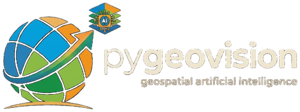

<!-- <div align="center">
 -->


## ⚠️ Important Note

This project is **actively under development**. While the core functionality 
is production-ready and thoroughly tested, some advanced features are still 
being refined.

[](https://pypi.python.org/pypi/pygeovision)
[](https://opensource.org/licenses/MIT)
[](https://pypi.python.org/pypi/pygeovision)
[](https://appiahkubis14.github.io/pygeovision-docs/)
[](https://appiahkubis14.github.io/pygeofetch-docs/)
[](#-ai-inference--fully-pretrained)

**Go from "I need imagery of this place" to a finished map, mask, or dataset — without stitching together a satellite API, a preprocessing pipeline, and a separate AI platform yourself.**

</div>

---

## 📖 What PyGeoVision does for you

Applying AI to satellite imagery today usually means gluing together several unrelated tools: one library to find and download scenes, another to preprocess them, a separate AI platform (with its own account and licensing) to run models, and custom glue code to keep it all working together. Every join in that chain is a place things quietly break.

PyGeoVision replaces that chain with one package:

- **You get one search/download call across 22 satellite providers** — Sentinel, Landsat, Planet, Maxar, Copernicus, USGS, and more — instead of learning 22 different APIs and managing 22 sets of credentials.
- **You get real AI models that run inside PyGeoVision itself** — segmentation, detection, change detection, classification, foundation models — with no separate AI-platform account, API key, or licensing fee. Every prediction runs on code that ships in this package.
- **You get the boring-but-critical middle step handled for you**: cloud masking, atmospheric correction, reprojection, tiling, band normalization — the preprocessing work that otherwise eats most of a project's time.
- **You get 51 ready-made pipelines** for common jobs (building footprints, change detection, land cover, flood/water mapping, deforestation, crop monitoring, disaster assessment) that take you from a bounding box to a finished output in one function call.
- **You get it as a CLI, a Python library, and a deployable inference server** — so the same models work whether you're exploring in a notebook, automating a pipeline, or serving predictions in production.

In short: fewer libraries to learn, fewer accounts to manage, less glue code to maintain, and a shorter path from "I have a location and a question" to "I have an answer."

---

## 📝 Who this is for

- **Geospatial researchers** who want to go from satellite search to AI inference in one import, without installing or licensing a separate AI platform.
- **AI/ML practitioners** who want satellite data without hand-rolling API clients, auth flows, and file-format handling for each provider.
- **Organizations** who need production tooling — a CLI, a REST/WebSocket inference server, YAML-scheduled pipelines, experiment tracking — not just a research script.

Existing tools like TorchGeo and TerraTorch provide excellent modeling building blocks but leave data acquisition as a separate problem. PyGeoVision owns both ends of that pipeline, in one package.

---

### 🛰️ Satellite Data — 22 Providers, One Interface

Instead of learning a different API for every satellite provider, you search and download the same way regardless of which one has the imagery you need.

- Unified search and download across Sentinel, Landsat, Planet, Maxar, Airbus, USGS, Copernicus, NASA, JAXA, and more
- Credentials handled once via system keyring — no scattered API keys in scripts
- Parallel downloads with checksum verification, resume support, and bandwidth throttling
- Full optical preprocessing built in: atmospheric correction, cloud masking, topographic correction, pan-sharpening, mosaicking, re-projection — so you don't write this yourself. SAR/InSAR processing (despeckle, calibration, flood mapping, interferometry) is handled by calling [pygeofetch](https://pypi.org/project/pygeofetch/)'s real, native SAR/InSAR modules directly — see the SAR & InSAR section below
- Post-processing chains (reproject → compress → NDVI/NDWI → Cloud Optimized GeoTIFF) as one call
- YAML pipelines with cron scheduling for recurring jobs

### 🤖 AI Inference — Fully Native, No External Platform

Every model below runs inside PyGeoVision — there's no separate AI platform to sign up for, and no calls leaving your infrastructure unless you choose cloud deployment.

- **Segmentation** — buildings, water (NDWI), general SAM auto-segmentation, or bring your own model
- **Detection** — general objects, ships, cars via native YOLO, or your own model
- **Classification** — CLIP zero-shot scene classification, ESA WorldCover land cover
- **Change detection** — a bi-temporal transformer (ChangeFormer), with a dependency-free spectral-diff fallback if you don't need the full model
- **Foundation models** — NASA Prithvi-EO-2.0, DINOv3, SAM, TESSERA satellite embeddings, AlphaEarth Foundations
- **Explainability** — GradCAM/GradCAM++, uncertainty estimation, attention maps, SHAP, so predictions aren't a black box
- **Monitoring** — drift detection, performance tracking, alerting for models in production
- **Deployment** — ONNX Runtime, NVIDIA Jetson, AWS SageMaker, Azure ML, GCP Vertex AI
- **Inference server** — FastAPI REST + WebSocket, with batch inference and a model registry, for when you need to serve predictions rather than run them ad hoc

### ⚙️ End-to-End Pipelines (51)

Each of these takes you from a bounding box and a date to a finished output — no manual wiring between data, preprocessing, and model.

| Pipeline | What you get |
|----------|-------------|
| `building_footprints` | Segmented buildings as GeoTIFF/vector, from Sentinel-2 or NAIP |
| `change_detection` | A change mask between two dates |
| `land_cover` | A classified land-cover map |
| `water_bodies` | A water extent mask (NDWI-based) |
| `solar_detection` | Detected solar installations |
| `crop_monitoring` | A crop-type map from a seasonal image stack |
| `disaster_assessment` | A damage assessment from post-event imagery |
| `deforestation` | A forest-loss mask between two dates |
| `urban_growth` | An urban-expansion map between two dates |
| `carbon_estimation` | An NDVI-based vegetation/carbon proxy (an uncalibrated screening estimate — see the docs for what it can and can't be used for) |

*(41 more pipelines are available — run `pygeovision pipeline list` for the full catalogue.)*

### 🧠 A Training Stack, Not Just Inference

If the built-in models aren't enough, you can train your own without leaving the package.

- 119+ registered architectures — U-Net, SegFormer, DeepLabV3+, FCOS, ViT, ChangeFormer, YOLOv8/v9, foundation-model backbones, and more
- Specialist losses for real geospatial imbalance problems (Dice, Focal, Tversky, Boundary-Aware, Lovász, OHEM, Combo, Class-Balanced)
- Distributed multi-GPU training, mixed precision, gradient accumulation
- `TiledInference` with Gaussian-blended tiling, so a model trained on small chips runs cleanly on a full scene
- Built-in experiment tracking and drift detection for the training-to-production handoff

### 🏷️ Automated Labeling — Skip Manual Annotation

Training data is usually the real bottleneck. PyGeoVision can generate labels for you from seven sources — OpenStreetMap, Microsoft Global Buildings, Google Open Buildings, ESA WorldCover, Google Dynamic World, SAM auto-labeling, and foundation-model labeling — so you can get a first training set without annotating from scratch.

### 🛰️ SAR & InSAR — via PyGeoFetch, Not a Duplicate Wrapper

SAR/InSAR processing (despeckle, radiometric calibration, flood mapping, InSAR coherence, interferogram generation, phase unwrapping, SLC InSAR) is handled by [pygeofetch](https://pypi.org/project/pygeofetch/) directly — a real, independently-verified implementation, not something PyGeoVision duplicates. Install it (`pip install pygeofetch`) and call `pygeofetch.processing.sar.SARProcessor` / `pygeofetch.sar.*` / `pygeofetch.insar.*` directly for despeckling, calibration, flood mapping, coherence, and the full InSAR pipeline.

What PyGeoVision *does* still own on the SAR side, since it's genuinely model-integration work, not raw signal processing:

- **SAR-to-foundation-model bridging** — maps 2-band SAR (VV/VH) into the band formats Prithvi and DINOv3 expect, via `pygeovision.models.adapters.sar_prithvi` / `sar_dinov3` / `sar_channel_manager`, including pre/post co-registration for change detection and input validation before model calls

---

## 📦 Installation

```bash
pip install pygeovision                      # core: data search/download + basic inference
pip install "pygeovision[geo]"                # + rasterio, geopandas, rioxarray
pip install "pygeovision[train]"              # + PyTorch, SMP, transformers, timm
pip install "pygeovision[foundation]"         # + Prithvi-EO-2.0, DINOv3
pip install "pygeovision[vlm]"                # + CLIP, Moondream
pip install "pygeovision[labeling]"           # + auto-labeling sources
pip install "pygeovision[xai]"                # + explainability
pip install "pygeovision[timeseries]"         # + time-series analysis
pip install "pygeovision[serve]"              # + FastAPI inference server
pip install "pygeovision[edge]"               # + ONNX Runtime edge deployment
pip install "pygeovision[cloud]"              # + AWS/Azure/GCP deployment SDKs
pip install "pygeovision[enterprise]"         # + RBAC, SSO, audit logging
pip install "pygeovision[all]"                # everything except cloud/edge (install those explicitly)
```

**Requirements:** Python 3.10+ · PyTorch 2.0+ is only needed for training or deep-model inference — search, download, NDWI/NDVI segmentation, and land-cover labeling all work without it.

---

## ⚡ Quick Start

A real workflow — search, download, and run a foundation model — in about 15 lines:

```python
import pygeovision as pgv

client = pgv.PyGeoVision()

# Search and download Sentinel-2 for a bounding box
results = client.search(bbox=(38.6, 8.9, 38.95, 9.15),
                         date_range=("2024-01-01", "2024-04-30"),
                         cloud_cover_max=15)
scene = client.download(results[:1], output_dir="./data",
                         bands=["B02","B03","B04","B08","B11","B12"])[0]

# Preprocess (cloud masking, normalization, band mapping) and predict land cover
ready = client.prepare_for_ai(scene.path, model_type="foundation",
                               output_path="./data/ready.tif")
client.classify.land_cover(ready["output_path"], output_path="./land_cover.tif")
```

`client.validator.validate(...)` will check any of these outputs — raw, preprocessed, or predicted — and auto-fix common issues (bad CRS, wrong nodata, out-of-range values) rather than just flagging them.

The same set of models covers segmentation, detection, and change detection just as directly:

```python
client.segmentation.buildings("scene.tif", output_path="buildings.tif")
client.detection.ships("port.tif", output_path="ships.tif")
client.change.detect(before="2020.tif", after="2024.tif", output_path="change.tif")
```

...and SAR/InSAR uses pygeofetch directly — despeckle and calibrate a Sentinel-1 scene, then run interferogram/coherence processing:

```python
from pygeofetch.processing.sar import SARProcessor

sar = SARProcessor()
despeckled = sar.despeckle("s1_raw.tif", filter="lee")
calibrated = sar.calibrate(despeckled.output_path, output_type="sigma0", in_db=True)
# Full InSAR pipeline (interferogram, unwrapping, timeseries): see pygeofetch.insar.*
```

---

## 🖥️ Command Line

Everything above is also a CLI command, for scripting or scheduled jobs:

```bash
pygeovision data search --bbox -74.1 40.6 -73.7 40.9 --providers planetary_computer
pygeovision data download --bbox -74.1 40.6 -73.7 40.9 --output ./data/

pygeovision ai segment buildings --input scene.tif --output buildings.tif
pygeovision ai change --before 2020.tif --after 2024.tif --output change.tif

pygeovision pipeline building_footprints --bbox -74.1 40.6 -73.7 40.9 --date 2024-06
pygeovision pipeline list

pygeovision status   # what's installed and working
pygeovision doctor   # diagnose a broken setup
```

Run `pygeovision --help` for the full command tree — it also covers `models`, `label`, `explain`, `monitor`, `edge`, `cloud`, `vlm`, `timeseries`, `validate`, `preprocess`, `indices`, `postprocess`, `benchmark`, and `datasets`. SAR/InSAR preprocessing is via pygeofetch directly (`pygeofetch.processing.sar.SARProcessor`, `pygeofetch.insar.*`) rather than through PyGeoVision.

---

## 🌐 Serving Predictions in Production

When you need to serve models rather than run them ad hoc, the same models are available behind a REST + WebSocket API:

```python
from pygeovision.serving.api import create_app
import uvicorn

uvicorn.run(create_app(auth_keys={"myuser": "myapikey"}), host="0.0.0.0", port=8080)
```

This gives you `POST /predict`, `POST /predict/batch`, `GET /models`, `POST /models/register`, `GET /metrics`, and `WS /ws/stream` — the same models, ready for a production traffic pattern instead of a single script run.

---

## 🧪 Testing

```bash
pip install "pygeovision[dev,train,geo]"
pytest tests/
```

864 tests pass with the full stack (including PyTorch) installed; 620 pass without PyTorch, covering everything except deep-model training/inference paths.

---

## 📋 Documentation

Full docs, tutorials, example notebooks, pipeline configuration guides, and the contributing guide are at **https://appiahkubis14.github.io/pygeovision-docs/**.

---

## 🤝 Contributing

Contributions of all kinds are welcome — see [CONTRIBUTING.md](CONTRIBUTING.md) for how to get started.

---

## 📄 License

PyGeoVision is free and open source software, licensed under the [Apache 2.0 License](LICENSE).

---

## Acknowledgements

PyGeoVision's satellite data layer is built on **[PyGeoFetch](https://appiahkubis14.github.io/pygeofetch-docs/)**, a universal satellite data pipeline that handles search, download, authentication, caching, and pipeline orchestration. Every AI capability — segmentation, detection, classification, change detection, foundation models, training, and serving — is implemented natively inside PyGeoVision itself.